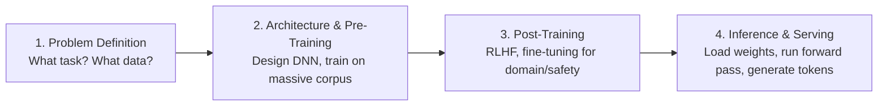
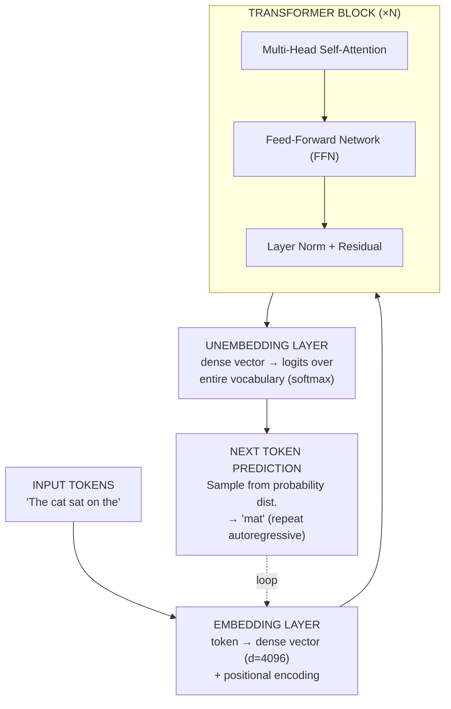
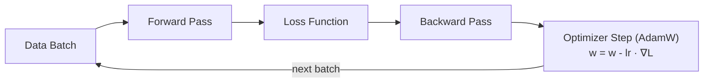
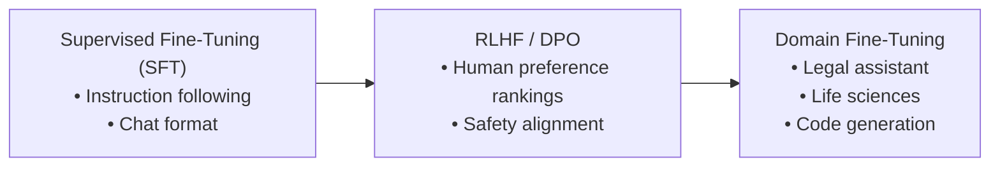
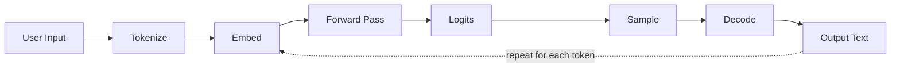

This is the first post in a four-part series where I break down how large language models (LLMs) are built, refined, and served at scale:

1. **Part 1 (this post):** The end-to-end pipeline overview
2. **Part 2:** Inference execution — GPU memory, batching, and serving at scale
3. **Part 3:** Deep dive into pre-training — data, compute, and optimization
4. **Part 4:** Post-training — RLHF, fine-tuning, and domain adaptation

Our lens here is that of a distributed systems engineer — someone used to scaling traditional software with compute and storage. Now we ask: what changes when the workload is AI on GPUs?

This series succeeds if you walk away understanding the why, not just the what. Take batching: in a traditional web service, each request (say, liking a post) is processed independently. In LLM inference we batch requests together — why? Because neural networks and GPUs are optimized for high-dimensional tensors. One request is an M×N matrix; K batched requests become an M×N×K tensor that flows through the pipeline in a single pass. We will dive deep more into this in Part-2. 

---

## The Four Stages of Building an LLM

Building a modern LLM is a pipeline with four distinct stages. Each stage has its own engineering challenges, cost profile, and iteration cycle.

---

## Stage 1: Picking the Problem

Everything starts with what problem you are trying to solve. Be it detecting digits from image(image net), or chat system, coding agent, you define the problem and the metric to measure how close we are to the optimal solution. 

Some systems built model on EEG data, to convert human thought into text (https://www.zyphra.com/our-work/zuna)

Every decade of deep learning has its signature problem:

| Era | Problem | Breakthrough |
|-----|---------|--------------|
| 2012–2016 | Image classification | CNNs (AlexNet, ResNet) |
| 2016–2020 | Machine translation | Attention & Transformers |
| 2020–2024 | Conversational AI | GPT, Claude, ChatGPT |
| 2024–present | Agentic coding assistants | Claude Code, Copilot |
| Future | AGI?, Brain-Computer interface?   |  |

The problem defines everything downstream — the data you collect, the architecture you choose, the loss function you optimize, and the latency budget you have at inference time.

---

## Stage 2: Architecture & Pre-Training

Modern LLMs follow the **decoder-only transformer** architecture (GPT-style). Here is the high-level data flow for a single forward pass:

### The Training Loop

Pre-training optimizes model weights across billions of tokens using this loop:

Three things define pre-training: the model architecture (how many layers, what each layer does), the loss function (how far off is our prediction from reality?), and the optimizer (we got it wrong — how do we correct ourselves?).

Key concepts:

- **Forward pass:** Input flows through the network, producing a predicted next-token distribution
- **Loss function:** Cross-entropy loss measures how far the prediction is from the actual next token

$$\mathcal{L} = -\sum_{t=1}^{T} \log P(x_t \mid x_{<t})$$

- **Backward pass:** Compute gradients of the loss with respect to every weight via backpropagation
- **Optimizer step:** Update weights to reduce loss (typically AdamW with learning rate warmup + decay)

We will dive deep into distributed training, data parallelism, and memory optimization in Part 3.

---

## Stage 3: Post-Training

The base pre-trained model is a next-token predictor. Post-training transforms it into a useful assistant:

**RLHF (Reinforcement Learning from Human Feedback):**
1. Humans rank multiple model outputs for the same prompt
2. A reward model is trained on these rankings
3. The LLM is fine-tuned via PPO (or DPO) to maximize the reward signal

This is what makes a raw language model actually *helpful*, *harmless*, and *honest*.

---

## Stage 4: Inference Execution

Once trained, serving the model means running the forward pass for every user request:

### Key Challenges at Inference Time

| Challenge | Description |
|-----------|-------------|
| **Model doesn't fit in one GPU** | Tensor parallelism splits layers across GPUs; pipeline parallelism splits layers sequentially |
| **High request volume** | Continuous batching (e.g., vLLM) processes multiple requests simultaneously |
| **KV-cache memory** | Attention keys/values cached per token — grows linearly with sequence length |
| **Latency vs throughput** | Time-to-first-token (prefill) vs tokens-per-second (decode) tradeoffs |

We will explore inference optimization in depth in Part 2 — covering PagedAttention, speculative decoding, quantization, and multi-GPU serving strategies.

---

## What's Next

In upcoming posts:
- **Part 2:** Inference execution — what happens when model weights don't fit in a single GPU, how batching works, and how systems like vLLM and TensorRT-LLM serve millions of requests.
- **Part 3:** Pre-training deep dive — how data is prepared, how training is distributed across thousands of GPUs, and how loss curves guide decisions.
- **Part 4:** Post-training — RLHF, DPO, supervised fine-tuning, and building domain-specific models.

Stay tuned.
