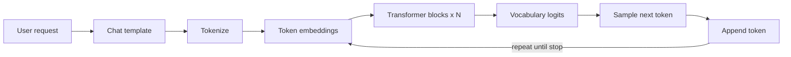
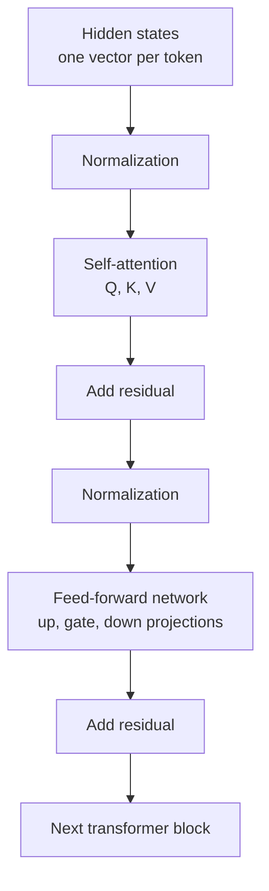
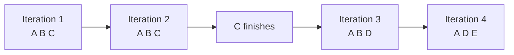
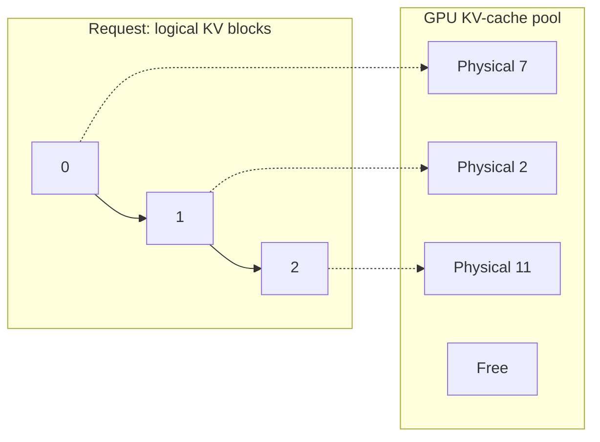
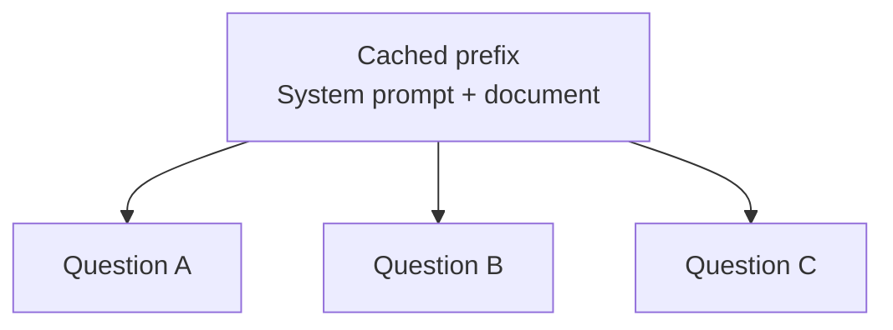

In [Part 1](/blog/llm-pipeline-overview/), we followed an LLM from problem definition through pre-training, post-training, and serving. This post zooms in on the last stage: **inference**, where a trained model executes user requests and generates responses.

Training asks, "How should the model's weights change?" Inference asks, "Given fixed weights and this prompt, what token should come next?" There is no backward pass or optimizer step. But inference is not simple: every generated token requires another forward pass, model weights occupy substantial GPU memory, and each active request accumulates its own attention state.

We will build the picture in three layers:

1. What happens to one request inside the model
2. How the model itself is optimized for inference
3. How a serving engine such as vLLM handles many concurrent requests

---

## 1. Executing One User Request

Suppose the user asks:

> Why is the sky blue?

At a high level, the request follows this path:



The API first formats the conversation using the model's chat template. The tokenizer then converts text into token IDs. Tokens are pieces of text, not necessarily whole words; for example, a tokenizer may split an uncommon word into several subword tokens.

Each token ID indexes a learned embedding table and becomes a dense vector of size $d_{model}$. Positional information is also introduced so that the model can distinguish the first token from the tenth.

This is **token embedding inside the language model**. It is different from producing one embedding for an entire document for vector search. A request may use both mechanisms in a RAG system, but the transformer itself starts from one vector per input token.

### Prefill and Decode

Inference has two computationally different phases:

| Phase | What the model processes | Typical characteristic |
|---|---|---|
| **Prefill** | All prompt tokens | Large matrix operations; usually compute-bound |
| **Decode** | One new token per request per iteration | Repeated weight reads; often memory-bandwidth-bound |

During prefill, all prompt tokens can pass through the model in parallel, subject to causal masking. The model also creates a **KV cache** containing attention keys and values for those tokens.

During decode, the model generates one token, appends it to the sequence, and runs again. It reuses the cached keys and values instead of recomputing the entire conversation. This autoregressive loop continues until the model emits a stop token or reaches a configured limit.

### Inside a Transformer Block

A decoder-only model contains many transformer blocks. The exact ordering varies by architecture, but a common pre-normalization block is:

$$
h' = h + \operatorname{Attention}(\operatorname{Norm}(h))
$$

$$
h_{out} = h' + \operatorname{MLP}(\operatorname{Norm}(h'))
$$

Each block therefore has two main computational sublayers:

1. **Self-attention:** mixes information across token positions
2. **Feed-forward network (FFN or MLP):** transforms each token's representation independently

Residual connections add each sublayer's output back to its input. They preserve information and make very deep networks trainable.



### Attention: Query, Key, and Value

Let $X$ be the matrix of hidden states entering attention. Learned projection matrices produce three representations:

$$
Q = XW_Q, \qquad K = XW_K, \qquad V = XW_V
$$

Their roles are easiest to understand as a lookup:

- **Query ($Q$):** what information is this token looking for?
- **Key ($K$):** what kind of information does each token contain?
- **Value ($V$):** what information should be returned if that token is relevant?

The query for each token is compared with the keys of tokens it is allowed to see. A scaled dot product produces the attention scores:

$$
S = \frac{QK^T}{\sqrt{d_k}}
$$

A causal mask sets scores for future positions to negative infinity. Softmax then converts the remaining scores into weights, and those weights combine the value vectors:

$$
\operatorname{Attention}(Q,K,V) =
\operatorname{softmax}\left(\frac{QK^T}{\sqrt{d_k}} + M\right)V
$$

Consider the phrase, "The animal did not cross the street because **it** was tired." The query for "it" can score highly against the key for "animal." The corresponding value carries information about that token into the representation for "it."

Models run several attention heads in parallel. Different heads can learn different relationships: local syntax, long-range references, position, or other patterns. Their outputs are concatenated and projected back to the model dimension.

During decode, only the newest token needs a new query, key, and value. The earlier keys and values are already in the KV cache. The new query attends to all cached keys, and the resulting attention weights combine their cached values. This is why the cache stores **K and V, but not Q**: an old query is not needed after its token has been processed.

For a conventional multi-head attention model, KV-cache memory grows approximately as:

$$
2 \times L \times T \times H_{kv} \times d_{head} \times b
$$

where $L$ is the number of layers, $T$ is the number of cached tokens, $H_{kv}$ is the number of key/value heads, and $b$ is bytes per element. The factor of two is for keys and values. Grouped-query and multi-query attention reduce this cost by using fewer KV heads than query heads.

### The Second Sublayer: The Feed-Forward Network

Attention decides **which token information to combine**. The feed-forward network performs a richer nonlinear transformation on each resulting token vector.

A traditional FFN contains an up-projection, activation, and down-projection:

$$
\operatorname{FFN}(x) = W_{down}\,\sigma(W_{up}x)
$$

Many current LLMs use a gated variant such as SwiGLU:

$$
\operatorname{SwiGLU}(x) =
W_{down}\left(\operatorname{SiLU}(W_{gate}x) \odot W_{up}x\right)
$$

What data exists here?

- The **input activation** is the contextualized vector for each token, with width $d_{model}$.
- The **up and gate projections** expand it into a larger intermediate dimension.
- The **activation and gate** select and shape useful features.
- The **down projection** returns the result to $d_{model}$ so it can be added through the residual path.
- The projection matrices are learned model weights and are identical across requests; the activation values are temporary and request-specific.

Unlike attention, the FFN does not mix one token position with another. The same FFN weights are applied independently to every token. In many dense LLMs, these large projection matrices contain a substantial fraction of all model parameters and inference work.

After the final transformer block, a projection maps each final hidden state to one score, or **logit**, per vocabulary token. Temperature, top-$k$, top-$p$, and other sampling rules turn the last position's logits into the next token. The token is decoded to text and streamed to the user while the loop continues.

---

## 2. Optimizing the Model for Inference

Before serving traffic, we can reduce how much memory and computation the model requires. The most common technique is **quantization**.

### Why Quantize?

Model weights are usually trained in floating-point formats such as FP32, BF16, or FP16. A model with $P$ parameters needs roughly:

$$
	ext{weight memory} \approx P \times \text{bytes per parameter}
$$

A 70-billion-parameter model therefore needs about 140 GB for FP16 weights alone. At four bits per weight, the raw weights need about 35 GB, before scales, metadata, KV cache, and runtime workspace.

Quantization maps many high-precision values onto a smaller set of representable values. For a simple uniform affine scheme:

$$
q = \operatorname{clamp}\left(\operatorname{round}\left(\frac{w}{s}\right) + z, q_{min}, q_{max}\right)
$$

$$
\hat{w} = s(q-z)
$$

The scale $s$ and zero point $z$ define the grid. Rounding chooses the nearest grid value. This introduces error because $\hat{w}$ is only an approximation of $w$.

Quantizers commonly calculate a separate scale per tensor, channel, or small group of weights. Smaller groups adapt better to local ranges but require more scale metadata.

| Format | Approximate weight size | Typical tradeoff |
|---|---:|---|
| FP16/BF16 | 16 bits | Strong baseline quality and broad hardware support |
| FP8 | 8 bits | Lower memory and high throughput on supported accelerators |
| INT8 | 8 bits | Mature compromise between quality and compression |
| INT4 | 4 bits | Major memory reduction, with greater quality and kernel sensitivity |

**Activations** are the temporary numerical values the model produces while processing a request. The input token representations become activations, and each attention and feed-forward operation produces new activation tensors that are passed to the next operation. Unlike weights, activations are not learned parameters stored permanently in the model: they depend on the current tokens, batch, and generation step, and usually live only long enough to complete the computation that needs them. The KV cache is related runtime state, but it is stored longer so future decoding steps can reuse earlier keys and values.

Notation such as **W4A16** describes the precision used for both kinds of data: **W4** means the model weights are represented with four bits, while **A16** means the intermediate activations remain at 16-bit precision, typically FP16 or BF16. **W8A8** means both weights and activations use eight bits. Weight-only quantization is often simpler because activation ranges change with every input and can contain outliers, making them harder to represent accurately with fewer bits.

Quantization is not automatically faster. Its result depends on hardware support, optimized kernels, dequantization overhead, batch shape, and whether inference is limited by memory bandwidth or computation. Quality must also be evaluated on the model's real workload.

### Nearest-Value Quantization, AWQ, and GPTQ

The basic nearest-value method minimizes error on each weight in isolation. But not every weight error affects the model output equally. Calibration-aware methods run representative data through the model and use observed behavior to protect important weights.

**AWQ (Activation-aware Weight Quantization)** observes activation magnitudes on calibration examples. Large activation channels indicate weights whose errors are more likely to affect outputs. AWQ protects those salient weights through per-channel scaling, then quantizes the weights, commonly to four bits. It is weight-only: the activations can remain in FP16 or BF16 during inference.

**GPTQ** is a post-training, weight-only quantization method. It processes layer weights in groups and uses approximate second-order information derived from calibration activations. As weights are quantized, GPTQ adjusts remaining weights to compensate for the introduced output error. It is more sophisticated than independently rounding every value to its nearest level.

Both methods need a representative calibration dataset. Calibration does not retrain the full model, but poor calibration data can still produce poor results.

### Serving Quantized Models with vLLM

There are two separate steps that are easy to conflate:

1. **Create or obtain a quantized checkpoint.** Tools such as LLM Compressor, AutoAWQ, or GPTQModel perform calibration and write quantized weights plus their scales and metadata.
2. **Serve that checkpoint with vLLM.** vLLM detects or is told the quantization format, loads the compact weights, and dispatches compatible kernels for the available hardware.

For example, a checkpoint already quantized with AWQ can be served with a command shaped like:

```bash
vllm serve <model-or-checkpoint> --quantization awq
```

Similarly, vLLM supports GPTQ checkpoints and several other formats. Exact compatibility varies by GPU architecture and vLLM release, so the serving format should be selected together with the target hardware, not in isolation.

Quantizing the KV cache is another, separate option. Weight quantization makes the fixed model smaller; KV-cache quantization reduces the request-dependent memory that grows with concurrent tokens. The two can be used independently or together.

---

## 3. Optimizing the Serving System

A smaller model is only part of the solution. A production server must keep the GPU busy while requests arrive at different times, contain different prompt lengths, and generate different numbers of tokens.

### Continuous Batching

Static batching waits for a group of requests, pads them to compatible shapes, and runs the group until every request finishes. If one response needs 20 tokens and another needs 500, the finished request leaves an unusable slot while the long request continues.

**Continuous batching** schedules work at each decoding iteration:

1. Active requests contribute their next token to the current iteration.
2. Finished requests leave immediately.
3. Waiting requests enter as soon as token and memory capacity becomes available.
4. The batch is rebuilt for the next iteration.



This is iteration-level scheduling rather than request-level scheduling. It improves throughput and GPU utilization while bounding how much work is admitted at once. The scheduler must still balance throughput against latency: very large batches can increase the time each request waits between tokens.

### The KV-Cache Allocation Problem

Every active sequence has a different and unpredictable lifetime. A server knows the current prompt length but usually does not know whether the answer will contain 10 tokens or 1,000.

A naive allocator reserves one contiguous KV-cache region for the request's maximum possible sequence length. Most requests finish early, wasting the reserved tail. If the allocator instead grows contiguous regions, it may need expensive relocation and eventually creates holes between differently sized allocations. There can be enough free memory in total but no sufficiently large contiguous region. This is **external fragmentation**.

The problem resembles process memory in an operating system. Requiring every process to occupy one contiguous range of physical RAM makes allocation and growth painful. Virtual memory gives a process a contiguous logical address space while a page table maps its virtual pages to non-contiguous physical frames.

Operating systems can also move pages between RAM and secondary storage. This makes the address-space abstraction larger than physical memory, although accessing an evicted page is much slower. The central idea is **indirection**: logical layout no longer has to equal physical layout.

### PagedAttention

vLLM applies this idea to the KV cache. It divides cache storage into fixed-size physical blocks, each holding keys and values for a fixed number of tokens. Every sequence has a logical block table that maps its ordered token blocks to physical blocks in GPU memory.



The request sees logically contiguous tokens even though its blocks are scattered in physical GPU memory. When the sequence grows, vLLM allocates another free block; it does not reserve the maximum sequence length or move the existing cache into a larger contiguous region.

This gives the serving engine several advantages:

- External fragmentation is greatly reduced.
- Waste is limited mainly to unused slots in the request's final block.
- Blocks can be allocated and released as sequences enter and finish.
- The same physical blocks can be shared safely for common prefixes, with new blocks allocated when sequences diverge.
- A scheduler can preempt, recompute, swap, or offload state when supported, without changing the sequence's logical token order.

PagedAttention does not make GPU memory unlimited. Its primary win is efficient allocation and indirection. Moving KV blocks outside GPU memory can extend capacity, but transfers are much slower than reading local GPU memory and therefore introduce a performance tradeoff.

### Prefix Caching

Many requests begin with exactly the same tokens:

- A shared system prompt used by every request
- The same long document followed by different questions
- A multi-turn conversation whose history grows by one turn
- Few-shot examples reused across a workload

Normally, each request repeats prefill computation for the common prefix and creates identical KV entries. **Prefix caching** stores the KV-cache blocks produced for a prefix. When a later request begins with the same token sequence and compatible model settings, the server reuses those blocks and computes only the uncached suffix.



Implementations identify reusable blocks with hashes derived from their token contents and prior prefix blocks. This makes reuse automatic and block-granular. Because the shared blocks are immutable, diverging requests append their own blocks rather than overwriting cached state.

Prefix caching improves **time to first token** and prefill throughput when prefixes are long and repeated. It does not make generation of new output tokens faster, and it provides no benefit when requests do not share exact prefixes. It also consumes KV-cache capacity, so eviction policy and cache hit rate matter.

### Speculative Decoding

Part 1 also promised speculative decoding. The bottleneck in decode is that a large model normally produces only one token per forward pass. Speculative decoding uses a cheaper draft mechanism to propose several tokens, then asks the target model to verify them together.

Accepted draft tokens preserve the target model's output distribution; rejected tokens are corrected by the target model. When acceptance is high, one expensive target-model pass advances several tokens instead of one. The gain depends on draft cost, acceptance rate, workload, and hardware utilization, so it complements rather than replaces batching and KV-cache management.

---

## Putting the Optimizations Together

These techniques address different bottlenecks:

| Technique | Primary resource saved | Most visible benefit |
|---|---|---|
| Quantization | Model-weight memory and bandwidth | Larger models or more cache space per GPU |
| Continuous batching | Idle GPU execution capacity | Higher request throughput |
| PagedAttention | KV-cache memory lost to allocation waste | More concurrent sequences |
| Prefix caching | Repeated prefill computation | Lower time to first token for shared prefixes |
| Speculative decoding | Target-model decode iterations | Lower inter-token latency when proposals are accepted |

The system should be measured with at least four metrics: **time to first token**, **inter-token latency**, **end-to-end latency**, and **tokens per second**. Optimizing one can hurt another. For example, waiting briefly to form a larger batch may improve total throughput while making the first user wait longer.

## What Happens When the Model Still Does Not Fit?

Quantization can shrink a model substantially, but it has limits. The GPU must hold model weights, runtime workspace, and enough KV cache for useful concurrency. A sufficiently large model may still not fit in one GPU's memory.

At that point, inference becomes a distributed-systems problem: which parts of the model live on which GPUs, what data must move between them for every token, and how do we prevent communication from dominating computation?

That is the subject of the next inference post: **multi-GPU inference with tensor parallelism, pipeline parallelism, and the communication costs behind them**.
