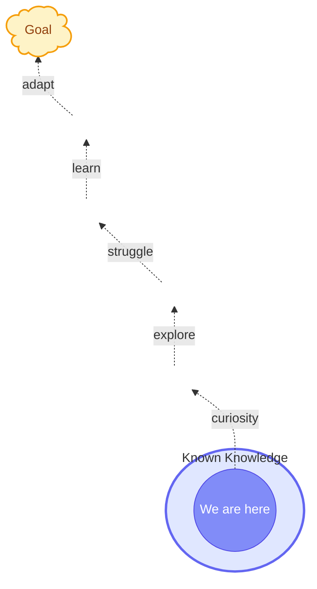

Finding alpha in financial markets is hard. The search space is enormous -- thousands of instruments, countless technical indicators, macro signals, and non-obvious correlations buried in noise. This post explores how I built an agentic system that automates the research loop of discovering profitable trading strategies.

---

## The Problem: Navigating the Search Space for Alpha

Every quantitative trader faces the same challenge: you need to find a statistical edge -- alpha -- in a sea of random price movements. The search space is combinatorially large. Which instruments? Which timeframes? Which features predict future moves? What's signal and what's noise?

Traditional quant research is a manual, iterative grind.

---

## The Traditional Approach

The conventional workflow looks like this:

1. **Form a hypothesis** -- e.g., *"When crude oil inventory reports show a drawdown larger than expected, prices tend to spike within the hour."*
2. **Code a backtest** -- translate that hypothesis into an algorithm, pull historical data, and run it against past markets.
3. **Evaluate results** -- check if the strategy shows statistical significance: Sharpe ratio, hit rate, drawdown, out-of-sample performance.
4. **Repeat** -- if the results are weak, tweak parameters, try a different feature, or discard and start over.

This cycle is slow. A single hypothesis might take hours or days to properly test. Most hypotheses fail. The feedback loop between "idea" and "validated result" is painfully long, and the researcher is the precious resource, should not waste energy on mechanical things like writing backtest and running. Let the agent do mechanical and repeatable tasks and researcher guide the agent.

---

## The Agentic Approach: Automating the Feedback Loop

What if we could compress this entire cycle into an autonomous loop? That's exactly what I built with [AgenticTrading](https://github.com/sarath-hotspot/AgenticTrading).

The core insight: an LLM agent can reason about financial data, generate novel hypotheses, write backtest code, interpret results, and iterate -- all with minimal human intervention between cycles.

The feedback loop becomes:

**Goal -> Hypothesis -> Build Backtest -> Gather Metrics -> Reason Over Results -> Refine Hypothesis -> Repeat**

It all starts with a high-level goal.

---

## Research as Discovery

Research is fundamentally a process of using existing knowledge to push beyond the known boundary and find a path to our goal.



The agent starts from what we know (domain knowledge, prior experiment results) and explores outward -- forming hypotheses, testing them, learning from failures, and adapting its approach until it reaches the goal.

---

## The Agent Control Loop

The system is built around four components working in a continuous cycle:


### The Four Components

1. **Hypothesis Generator** -- Takes the configured goal and all past experiment results, then uses LLM models to generate a novel hypothesis that moves toward the objective. It avoids repeating failed approaches and builds on partial successes.

2. **Experiment Agent** -- Translates the hypothesis into a full QuantConnect Python backtest algorithm. It handles compile errors autonomously, runs the backtest against historical data, and stores the complete results.

3. **Goal Evaluator** -- Checks whether the experiment reached the success threshold (e.g., >70% prediction accuracy on out-of-sample data). If achieved, the loop stops. If not, the results feed back into the hypothesis generator.

4. **Control Loop** -- Orchestrates the entire cycle, persists state between iterations, and supports resumption if interrupted.

---

## Defining the Goal

The system is goal-driven. Here's an example configuration I used for crude oil futures:

```
Goal:
- Look at Crude oil and natural gas futures data, we are interested in events
  where price increased or dropped by 1%, predict these large moves.
```

```
Domain instructions:
- Use price volume information to find patterns before big moves.
- Anything >70% prediction accuracy is considered valid goal.
- Make sure to calculate the prediction accuracy in out of sample test set.
- Use different granularity data, hourly, minute, etc.
- Use digital signal processing techniques to avoid noise and finding signal.
```

The goal, domain constraints, and background knowledge are all configurable -- the engine researches whatever objective you point it at.

---

## Project Architecture

```
AgenticTrading/
|-- config/
|   |-- goal.md               # Trading objective
|   |-- instructions.md       # Domain constraints
|   +-- domain_knowledge.md   # Background knowledge
|-- engine/
|   |-- agents/
|   |   |-- hypothesis_agent.py   # Generates hypotheses via Claude
|   |   +-- experiment_agent.py   # Writes and runs QC backtests via Claude
|   |-- tools/
|   |   |-- quantconnect.py   # QuantConnect API client
|   |   |-- storage.py        # Experiment persistence
|   |   +-- websearch.py      # Optional web search (Serper)
|   |-- config_loader.py      # Reads config/ files
|   |-- loop.py               # Control loop with checkpointing
|   |-- run_logger.py         # File logging setup
|   |-- run_state.py          # Resume-state persistence
|   +-- cli.py                # CLI entry point
|-- experiments/              # Generated experiment records
|-- logs/                     # Run log files
+-- .env                      # Credentials
```

The engine uses the QuantConnect API for backtesting infrastructure, Claude for reasoning and code generation, and optionally Serper for web search to enrich hypotheses with current market context.

---

## Running It

Copy .env.example as .env and update the API keys for QuantConnect and Claude or OpenAI. 

```bash

# Run up to 5 iterations with human approval between each
engine run --max-iterations 5

# Fully autonomous -- no prompts, run until goal is reached
engine run --auto

# Resume an interrupted run
engine run --resume
```

Each iteration produces a full experiment record: the hypothesis, the generated algorithm code, QuantConnect project/backtest IDs, and detailed results -- all persisted as JSON for later analysis.

---

## Key Takeaways

- **The bottleneck in quant research is the human iteration speed** -- agents compress the hypothesis-to-result cycle from hours to minutes.
- **Goal-driven autonomy works** -- by defining a clear objective and success criterion, the agent can navigate the search space without hand-holding.
- **Failures are fuel** -- each failed experiment informs the next hypothesis. The agent learns from what didn't work, just as a human researcher would.
- **Separation of concerns** -- the hypothesis generator reasons about *what* to try; the experiment agent handles *how* to implement and test it. This mirrors how research teams work.

The full project is open source: [github.com/sarath-hotspot/AgenticTrading](https://github.com/sarath-hotspot/AgenticTrading)
